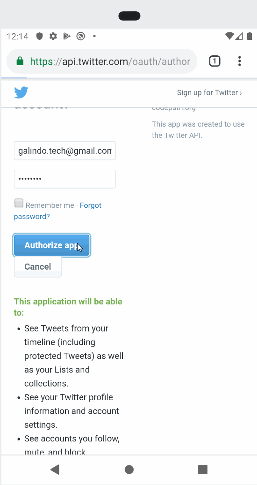

# Project 2 - *SimpleTweet* (part1)

**SimpleTweet** is an android app that allows a user to view his Twitter timeline. The app utilizes [Twitter REST API](https://dev.twitter.com/rest/public).

Time spent: **6** hours spent in total

## User Stories

The following **required** functionality is completed:
PART 1

  - [X] User can **sign in to Twitter** using OAuth login
  - [X]	User can **view tweets from their home timeline**
  - [X] User is displayed the username, name, and body for each tweet
  - [X] User is displayed the [relative timestamp](https://gist.github.com/nesquena/f786232f5ef72f6e10a7) for each tweet "8m", "7h"
  - [X] User can refresh tweets timeline by pulling down to refresh
PART 2

  - [X] User can **compose and post a new tweet**
  - [X] User can click a “Compose” icon in the Action Bar on the top right
  - [X] User can then enter a new tweet and post this to twitter
  - [X] User is taken back to home timeline with **new tweet visible** in timeline
  - [X] Newly created tweet should be manually inserted into the timeline and not rely on a full refresh
  - [X] User can **see a counter with total number of characters left for tweet** on compose tweet page
The following **optional** features are implemented:

  - [ ] User is using **"Twitter branded" colors and styles**
  - [ ] User can click links in tweets launch the web browser 
  - [ ] User can **select "reply" from detail view to respond to a tweet**
  - [ ] The "Compose" action is moved to a FloatingActionButton instead of on the AppBar
  - [X] Compose tweet functionality is build using modal overlay
  - [X] Use Parcelable instead of Serializable using the popular [Parceler library](http://guides.codepath.org/android/Using-Parceler).
  - [X] User can **open the twitter app offline and see last loaded tweets**. Persisted in SQLite tweets are refreshed on every application launch. While "live data"   is displayed when app can get it from Twitter API, it is also saved for use in offline mode.
  - [ ] When a user leaves the compose view without publishing and there is existing text, prompt to save or delete the draft. If saved, the draft should then be   **persisted to disk** and can later be resumed from the compose view.
  - [ ] Enable your app to receive implicit intents from other apps. When a link is shared from a web browser, it should pre-fill the text and title of the web page when composing a tweet. 

The following **additional** features are implemented:

- [ ] List anything else that you can get done to improve the app functionality!

## Video Walkthrough PART 1

Here's a walkthrough of implemented user stories PART 1:

GIF created with [LiceCap](http://www.cockos.com/licecap/).

## Video Walkthrough PART 2

Here's a walkthrough of implemented user stories PART 2:

## Notes

Structure of the whole application was very complex, but well constructed.
ran into small hurdles that mostly turned out to be communication links between classes.
will definetly master these skills!

## Open-source libraries used

- [Android Async HTTP](https://github.com/codepath/CPAsyncHttpClient) - Simple asynchronous HTTP requests with JSON parsing
- [Glide](https://github.com/bumptech/glide) - Image loading and caching library for Android

## License

    Copyright [yyyy] [name of copyright owner]

    Licensed under the Apache License, Version 2.0 (the "License");
    you may not use this file except in compliance with the License.
    You may obtain a copy of the License at

        http://www.apache.org/licenses/LICENSE-2.0

    Unless required by applicable law or agreed to in writing, software
    distributed under the License is distributed on an "AS IS" BASIS,
    WITHOUT WARRANTIES OR CONDITIONS OF ANY KIND, either express or implied.
    See the License for the specific language governing permissions and
    limitations under the License.
